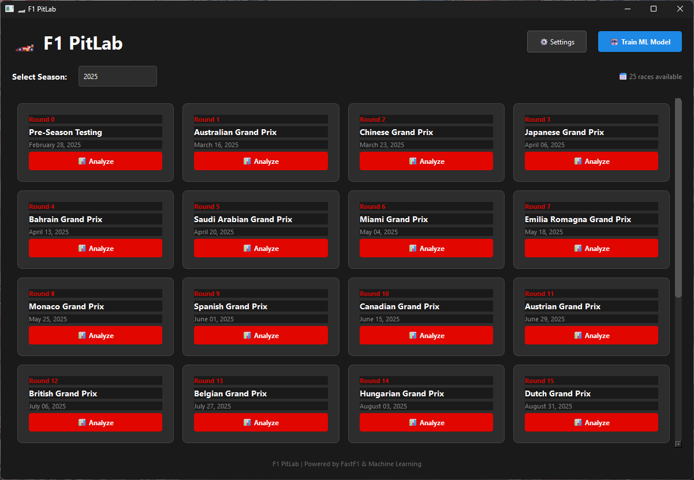
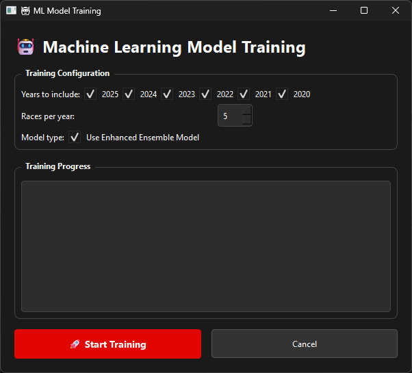
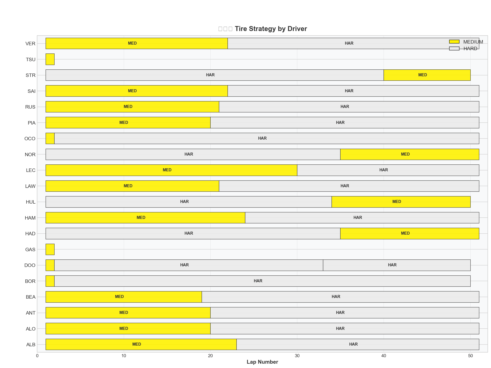

# 🏎️ F1 PitLab

**The Ultimate F1 Pit Stop Intelligence Platform**

Advanced Formula 1 pit stop analysis with **ML predictions**, **tyre degradation modeling**, **interactive visualizations**, and **PostgreSQL database**.


---

## 📸 Screenshots

### Main Application
<p align="center">
  
</p>

### ML Model Training
<p align="center">
  
</p>

### Tire Strategy Analysis
<p align="center">
  
</p>

### Pit Stop Analysis Charts
<p align="center">
  
</p>

---

## 📊 Features

### Core Analysis
- 🏁 Select and analyze any race from any season (2018–2025)
- 📡 Real-time F1 data via FastF1 API
- 📈 Comprehensive pit stop duration analysis by driver and team
- 💾 Smart caching for fast repeated analysis
- 🔄 Bulk pre-cache entire seasons

### Machine Learning
- 🤖 **Pit Stop Duration Prediction** - Ensemble model (Random Forest + Gradient Boosting + Bayesian Ridge)
- 📉 **Tyre Degradation Modeling** - Bayesian-inspired tyre wear predictions
- 🎯 **Optimal Pit Window Suggestions** - ML-driven strategy recommendations
- 🔍 **Anomaly Detection** - Identify unusual pit stops with Isolation Forest
- 📊 **Model Performance Metrics** - MAE, R², feature importance visualization

### Interactive Visualizations (Plotly)
- 🎨 F1-themed dark mode charts with official team colors
- 📊 Pit stop duration comparison charts
- ⏱️ Race timeline visualizations
- 🕸️ Team performance radar charts
- 📅 Tire strategy Gantt charts
- 🔥 Pit window heatmaps
- 🔮 ML prediction vs actual comparisons

### Database Integration
- 🐘 **PostgreSQL** support for production
- 📁 **SQLite** for local development
- 🗃️ Full data persistence (races, drivers, pit stops, predictions)
- 📈 Historical analytics and trend analysis

### User Interfaces
- 🖥️ **GUI Mode** - Modern PySide6 desktop application
- 💻 **CLI Mode** - Rich terminal interface with Questionary prompts

## 🛠️ Tech Stack

| Category | Technology |
|----------|------------|
| **Data** | FastF1, Pandas, NumPy |
| **ML** | scikit-learn (RF, GBM, BayesianRidge), scipy |
| **Visualization** | Plotly, Kaleido, Matplotlib, Seaborn |
| **Database** | SQLAlchemy 2.0, PostgreSQL, SQLite, Alembic |
| **GUI** | PySide6 (Qt6) |
| **CLI** | Questionary, Rich |
| **Config** | python-dotenv, Pydantic |

## 📈 Sample Output

```
🏁 PIT STOP ANALYSIS: Monaco Grand Prix 2024

🏆 PIT STOP RECORDS:
   🥇 Fastest: VER (Red Bull Racing) - 23.67s on Lap 18
   🥈 2nd: HAM (Mercedes) - 24.09s on Lap 22
   🥉 3rd: NOR (McLaren) - 24.36s on Lap 25

🤖 ML PREDICTIONS:
   Model: Ensemble (RF + GBM + BayesianRidge)
   MAE: 0.42s | R²: 0.89
   Predicted vs Actual: VER 23.52s vs 23.67s

📊 Interactive charts saved to charts/ folder
```

## 🚀 Getting Started

### Prerequisites
- Python 3.10 or higher
- PostgreSQL (optional, for production)

### Installation

1. **Clone the repository**
   ```bash
   git clone https://github.com/xt67/F1-pitstop-analyzer.git
   cd F1-pitstop-analyzer
   ```

2. **Create virtual environment**
   ```bash
   python -m venv venv
   ```

3. **Activate environment**
   - Windows: `venv\Scripts\activate`
   - Mac/Linux: `source venv/bin/activate`

4. **Install dependencies**
   ```bash
   pip install -r requirements.txt
   ```

5. **Configure database (optional)**
   
   Create a `.env` file for PostgreSQL:
   ```env
   DB_TYPE=postgresql
   DB_HOST=localhost
   DB_PORT=5432
   DB_NAME=f1_analyzer
   DB_USER=postgres
   DB_PASSWORD=yourpassword
   ```
   
   Or use SQLite (default - no configuration needed).

6. **Run the analyzer**
   ```bash
   python main.py
   ```

## 🕹️ Usage

### GUI Mode
Launch the graphical interface:
```bash
python main.py
```

Features:
- **Race Selection** - Browse seasons and races
- **Analysis Dashboard** - View pit stop statistics
- **ML Training** - Train models with progress tracking
- **Chart Export** - Save interactive HTML/PNG charts

### CLI Mode
Use the terminal interface:
```bash
python main.py --cli
```

### Database Operations
```python
from src.database import DatabaseConnection, DatabaseRepository

# Connect (auto-detects .env settings)
db = DatabaseConnection()
db.create_tables()

# Use repository for data operations
repo = DatabaseRepository(db)
pit_stops_df = repo.get_pit_stops_dataframe(year=2024)
```

## 📁 Project Structure

```
f1-pitstop-analyzer/
├── main.py                    # Entry point
├── requirements.txt           # Dependencies
├── .env                       # Database config (create this)
├── cache/                     # FastF1 data cache
├── charts/                    # Exported visualizations
├── src/
│   ├── charts/
│   │   ├── __init__.py
│   │   └── visualizations.py  # Plotly chart generator
│   ├── database/
│   │   ├── __init__.py
│   │   ├── models.py          # SQLAlchemy ORM models
│   │   ├── connection.py      # Database connection manager
│   │   └── repository.py      # Data access layer
│   ├── ml/
│   │   ├── __init__.py
│   │   ├── predictor.py       # Basic ML predictor
│   │   └── enhanced_predictor.py  # Advanced ensemble + tyre model
│   ├── gui/
│   │   ├── __init__.py
│   │   ├── main_window.py     # PySide6 main window
│   │   └── ml_training.py     # ML training dialog
│   └── cli/
│       └── interface.py       # Rich/Questionary CLI
└── venv/                      # Virtual environment
```

## 🤖 Machine Learning Details

### Ensemble Predictor
Combines three models for robust predictions:
- **Random Forest** - Captures non-linear patterns
- **Gradient Boosting** - Handles sequential dependencies
- **Bayesian Ridge** - Provides uncertainty estimates

### Tyre Degradation Model
Bayesian-inspired model that tracks:
- Compound-specific wear rates (SOFT > MEDIUM > HARD)
- Fuel load effects
- Track-specific degradation patterns

### Feature Engineering
- Driver/team historical performance
- Track characteristics
- Weather conditions
- Tyre compound & age
- Fuel-adjusted lap times

## 🔮 Roadmap

- [x] ~~Build ML model to predict pit stop times~~
- [x] ~~Add interactive dashboard~~
- [x] ~~Database persistence~~
- [ ] Real-time race predictions
- [ ] Strategy optimization engine
- [ ] Web dashboard (FastAPI + React)
- [ ] Multi-race comparative analysis

## 📝 License

MIT License - see [LICENSE](LICENSE) for details.

## 🙏 Acknowledgments

- [FastF1](https://github.com/theOehrly/Fast-F1) - F1 data API
- [IAmTomShaw/f1-race-replay](https://github.com/IAmTomShaw/f1-race-replay) - Design inspiration
- Formula 1® - For the exciting sport!

